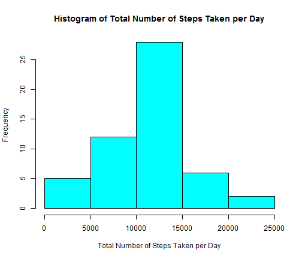
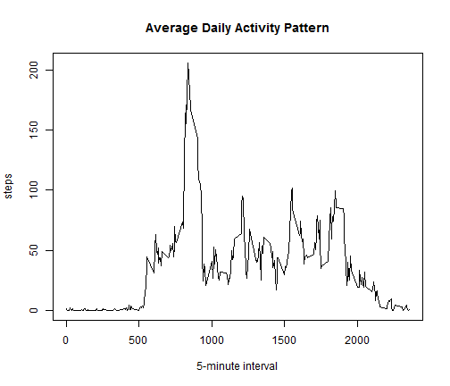
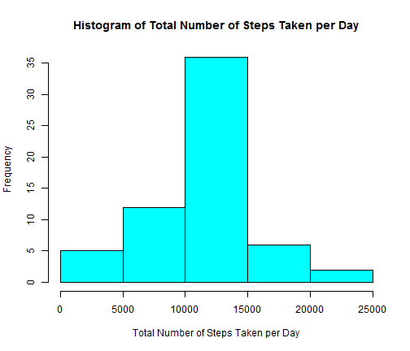
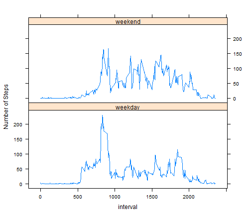

Reproducible Research Peer Assessment 1
========================================================

### 1. Loading and preprocessing the data

Load the activity monitoring data, and setup the environment


```r
library("lattice")
Sys.setlocale("LC_TIME", "US")
```

```
## [1] "English_United States.1252"
```

```r
activity <- read.csv("activity.csv", colClasses = c("numeric","character","numeric"))
```

### 2. What is mean total number of steps taken per day?

The histogram of the total number of steps taken each day, ignoring the missing values


```r
activity.date.steps <- aggregate(steps ~ date, data = activity, sum)

hist(activity.date.steps$steps, 
     xlab = "Total Number of Steps Taken per Day", 
     main = "Histogram of Total Number of Steps Taken per Day", 
     col = 5)
```

 

The mean and median of total number of steps taken each day are: 


```r
mean(activity.date.steps$steps)
```

```
## [1] 10766
```

```r
median(activity.date.steps$steps)
```

```
## [1] 10765
```

### 3. What is the average daily activity pattern?

The verage daily activity pattern

```r
activity.interval.steps <- aggregate(steps ~ interval, data = activity, mean)
plot(steps ~ interval, data = activity.interval.steps, type = "l",
     xlab = "5-minute interval", main = "Average Daily Activity Pattern")
```

 

```r
activity.interval.steps$interval[which.max(activity.interval.steps$steps)]
```

```
## [1] 835
```

The 5-minute interval, on average across all the days in the dataset, contains the maximum number of steps is:


```r
activity.interval.steps$interval[which.max(activity.interval.steps$steps)]
```

```
## [1] 835
```

### 4. Imputing missing values

Total number of missing values in the dataset


```r
sum(is.na(activity$steps))
```

```
## [1] 2304
```

Filling the missing using the mean for that 5-minute interval and create new data


```r
activity.steps.filled <- apply(activity, 1, FUN = function(x) {
                           as.numeric(ifelse(is.na(x["steps"]),
                             with(activity.interval.steps, steps[which(interval == as.numeric(x["interval"]))]), x["steps"]))})

activity.filled <- activity
activity.filled$steps <- activity.steps.filled 
```

The histogram of the total number of steps taken each day, after filling the missing values


```r
activity.filled.date.steps <- aggregate(steps ~ date, data = activity.filled, sum)

hist(activity.filled.date.steps$steps, 
     xlab = "Total Number of Steps Taken per Day", 
     main = "Histogram of Total Number of Steps Taken per Day", 
     col = 5)
```

 

The mean and median of the total number of steps taken each day, after filling the missing values 


```r
mean(activity.filled.date.steps$steps)
```

```
## [1] 10766
```

```r
median(activity.filled.date.steps$steps)
```

```
## [1] 10766
```

Notice that after filling the missing, the histogram is slightly more "concentrated" on the middle range. The mean keeps the same, because of the method of filling, while the median changed and equals to mean now.

### 5. Are there differences in activity patterns between weekdays and weekends?

The comparing charts of activity patterns between weekdays and weekends


```r
weekday <- as.factor(ifelse(weekdays(as.Date(activity.filled$date)) %in% c("Saturday", "Sunday"), "weekend", "weekday"))


activity.filled.weekday.steps <- aggregate(steps ~ weekday + interval, activity.filled, mean )

xyplot(steps ~ interval | weekday, data = activity.filled.weekday.steps, layout = c(1, 2), ylab = "Number of Steps", type = "l")
```

 

Based on the comparison, we could notice that:
- there are more steps on weekdays than weekends, during 5am - 9am. Properly this the reason of going work or school
- there are more steps on weekends than weekdays, during afternoon. Properly more activitis are taken at weekends.
